<div align="center">

# 얼음땡

</div>

**ADHD 아동을 위한 게이미피케이션 기반 행동 교정 및 집중력 향상 서비스**


**AI 시선 추적 및 행동 인식 기술**을 활용하여 아동의 집중 상태를 실시간으로 분석하고, **게이미피케이션** 요소를 통해 즐겁게 집중 습관을 기를 수 있는 모바일 플랫폼입니다.

> 딴짓하면 얼음! 집중하면 땡! 스스로 배우는 집중의 즐거움

- **개발 기간** : 2026.01.05 ~ 2026.02.13 **(6주)**
- **플랫폼** : Android Mobile App
- **개발 인원** : 6명
- **기관** : 삼성 청년 SW·AI 아카데미 14기 <br><br>


</div> <br>

## 🔎 목차

<div align="center">

### <a href="#developers">🌟 팀원 구성</a>

### <a href="#resources">🔽 설치 파일 및 모델 리소스</a>

### <a href="#techStack">🛠️ 기술 스택</a>

### <a href="#systemArchitecture">🌐 시스템 아키텍처</a>

### <a href="#skills">📲 기능 구성</a>

### <a href="#directories">📂 디렉터리 구조</a>

### <a href="#projectDeliverables">📦 프로젝트 산출물</a>

</div>
<br>

## 🌟 팀원 구성

<a name="developers"></a>

<div align="center">

<div align="center">
<table>
    <tr>
        <td width="33%" align="center"> <a href="https://github.com/thduss">
             <br> 김소연 <br>(Backend & DevOps & Leader) </a> <br></td>
        <td width="33%" align="center"> <a href="https://github.com/theundergroundt">
             <br> 김상지 <br>(Backend & JiraOps) </a> <br></td>
        <td width="33%" align="center"> <a href="https://github.com/sehyeon262">
             <br> 김세현 <br>(Frontend & Design) </a> <br></td>
    </tr>
    <tr>
      <td width="280px">
        <sub>
          - 인프라 및 CI/CD 무중단 파이프라인 구축·운영 <br>
          - neis API 연동 및 통계 API 구현 <br>
          - 모바일 소셜 로그인 OAuth2 인증 로직 최적화<br>
          - 협업 및 이벤트 알림 자동화 파이프라인 구축 <br>
        </sub>
      </td>
      <td width="280px">
        <sub>
          - OAuth2.0·JWT 통합 로그인/회원가입 구축 <br>
          - WebSocket STOMP 실시간 데이터 통신 구현 <br>
          - 시계열 로그 분석 기반 비집중 시간 산출 고도화 <br>
          - Jira 이슈 관리 및 협업 프로세스 최적화 <br>
        </sub>
      </td>
      <td width="280px">
        <sub>
        - 교사·학생 핵심 화면 및 수업 흐름 프론트엔드 구현 <br>
        - 학급·학생 관리 및 통계 페이지 API 연동 <br>
        - 서비스 전반 Figma UI/UX 디자인 설계 및 화면 구현 <br>
        </sub>
      </td>
    </tr>

</table>

<table>
    <tr>
        <td width="33%" align="center"> <a href="https://github.com/parkgeunyoung1">
         <br> 박근영 <br>(Frontend) </a> <br></td>
        <td width="33%" align="center"> <a href="https://github.com/dain2822">
         <br> 심다인 <br>(Frontend & AI) </a> <br></td>
        <td width="33%" align="center"> <a href="https://github.com/ssemim">
         <br> 종효련 <br>(Frontend) </a> <br></td>
    </tr>
    <tr>
        <td width="280px">
          <sub>
          - PiP 및 오버레이 활용 실시간 모니터링 환경 구축 <br>
          - 학습 결과 시각화 및 경험치 보상 피드백 UI 구현 <br>
          - NDK 기반 C++/Kotlin 네이티브 모듈 연동 및 빌드 최적화 <br>
          </sub>
        </td>
        <td width="280px">
          <sub>
          - AI 모델 연동 및 실시간 학생 행동 패턴 분석 <br>
          - WebSocket을 활용한 실시간 양방향 통신 구현 <br>
          - 사용자 인증 시스템 및 학급 관리 기능 개발 <br>
          </sub>
        </td>
        <td width="280px">
          <sub>
          - Axios 기반의 API 통신 및 에러 핸들링 <br>
          - Redux Toolkit 기반 전역 상태 관리 설계 <br>
          - expo 네이티브 모듈 통합 및 안드로이드 앱 빌드, 배포 <br>
          </sub>
        </td>
    </tr>

</table>
</div>
<br>

</div>

## 🔽 설치 파일 및 모델 리소스

<a name="resources"></a>

<div align="center">

|    **구분**    |                                                       **파일**                                                        | **용량** |                       **설명**                       |
| :------------: | :-------------------------------------------------------------------------------------------------------------------: | :------: | :--------------------------------------------------: |
| 📱 Android App |     [icethang.apk](https://drive.google.com/file/d/1Opf2AkC9Zqgd-QuibJGMWFg2XSJc5y9P/view?usp=drive_link)      | 32 KB |            Android 설치 패키지 (APK)             |
|   🤖 AI Model    |        [face_landmarker.tflite](https://drive.google.com/file/d/1po5cS7FCgX4DeItQsja_TTWwlYCIy43T/view?usp=sharing)         | 178.7 MB |    집중도 분석 모델 가중치 <br>   |

</div><br>

## 🛠️ 기술 스택

<a name="techStack"></a>

### 🌕 Frontend

<div align="center">


 <br>


<br>

|      **Category** |                                                                                                                              **Stack** |
| :---------------------: | :------------------------------------------------------------------------------------------------------------------------------------------------------------------------------------------------------------------------------------------------------------------: |
|      **Language** |                                                                                                                           TypeScript 5.9.2                                                                                                                           |
|       **Runtime** |                                                                                                                  React Native 0.81.5, React 19.1.0                                                                                                                   |
|      **Framework** |                                                                                                                              Expo 54.0.0                                                                                                                             |
| **State & Data Comm** |                                                                                Redux Toolkit 2.11.2, Axios 1.13.2, <br> StompJS 7.3.0, Expo Secure Store 15.0.8, Expo Device 8.0.10                                                                                  |
| **UI & Animation** |                                             NativeWind 4.2.1, Reanimated 4.1.1, <br> Lottie React Native 7.3.1, React Native Modal 14.0.0, <br> React Native PIP Android 1.0.1                                              |
|  **Camera & AI** |                                                                                                   Vision Camera 4.7.3, MediaPipe Vision 0.10.32                                                                                                      |
|         **IDE** |                                                                                                                     Visual Studio Code 1.103.1                                                                                                                       |

</div>

### 🌑 Backend

<div align="center">


<br>

<br>


|  **Category**  |                                                                                                                                          **Stack**                                                                                                                                           |
| :------------: | :------------------------------------------------------------------------------------------------------------------------------------------------------------------------------------------------------------------------------------------------------------------------------------------: |
|  **Language**  |                                                                                                                                           Java17 17                                                                                                                                            |
| **Framework**  |                                                                                                                                      Spring Boot 3.5.11                                                                                                                                       |
|  **Library**   | Spring Data JPA, Spring Security, Java JWT, Spring Security OAuth2 Client, <br> Spring WebSocket, Spring Data Redis, Lombok, Spring Boot Test |
|  **Database**  |                                                                                                                           MySQL 9.3.0, Redis 7.4.5                                                                                                                           |
|    **IDE**     |                                                                                                                          IntelliJ IDEA 2025.1.3 (Ultimate Edition)                                                                                                                           |
| **Build Tool** |                                                                                                                                        Gradle 8.14.3                                                                                                                                         |

</div>

### 🤖 AI (On-Device)

<div align="center">


<br>

|      **Category** |                                                                                                                              **Stack** |
| :---------------------: | :------------------------------------------------------------------------------------------------------------------------------------------------------------------------------------------------------------------------------------------------------------------: |
|      **Architecture** |                                                                                                                           On-Device Inference (Edge AI)                                                                                                                          |
|       **Core Engine** |                                                                                                                  MediaPipe Tasks Vision 0.10.32                                                                                                                   |
|      **Model** |                                                                                                                              Face Landmarker (TFLite)                                                                                                                             |
| **Input Source** |                                                                                React Native Vision Camera 4.7.3                                                                                  |
| **Processing** |                                             Real-time Frame Processor (Worklets)                                              |

</div>

### ⚙️ DevOps

<div align="center">


<br>


<br>
<br>

|    **Category**     |                          **Spec**                           |
| :-----------------: | :---------------------------------------------------------: |
|  **Instance Type**  |                          T2.XLARGE                          |
|       **CPU**       |                           4 vCPUs                           |
|       **RAM**       |                            16 GB                            |
| **Storage (Disk)**  |                   SSD: 320 GB, HDD: 6 TB                    |
|     **Docker**      |                           v28.1.1                           |
| **Docker Compose**  |                           v2.38.2                           |
|     **Jenkins**     |                            2.520                            |
|      **Nginx**      |                        nginx/1.18.0                         |
| **Webhook Handler** |                  Uvicorn[standard] 0.35.0                   |

</div>

### 🤝 Collaboration

<div align="center">


</div>
<br>

## 🌐 시스템 아키텍처

<a name="systemArchitecture"></a>

### 🖧 System Architecture

<div align="center">

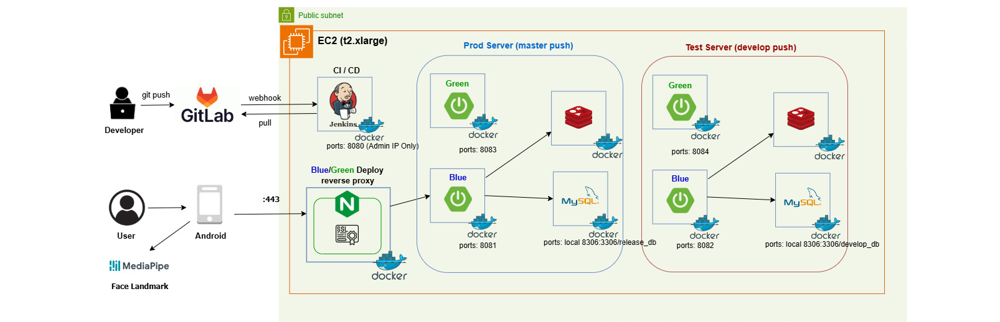
</div>

### 📢 Collaboration & Event Notification

<div align="center">

<table>
  <tr>
    <td align="center" width="50%"><b>❌ Jenkins Pipeline Failure</b></td>
    <td align="center" width="50%"><b>✅ Jenkins Pipeline Success</b></td>
  </tr>
  <tr>
    <td align="center">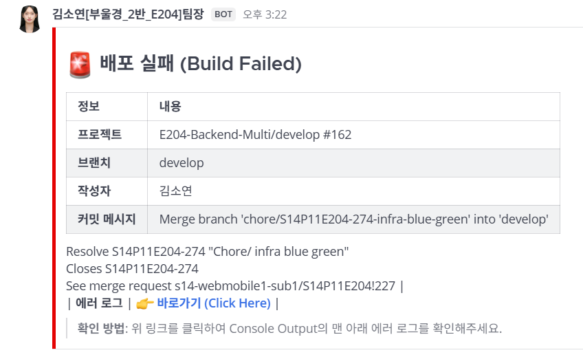</td>
    <td align="center">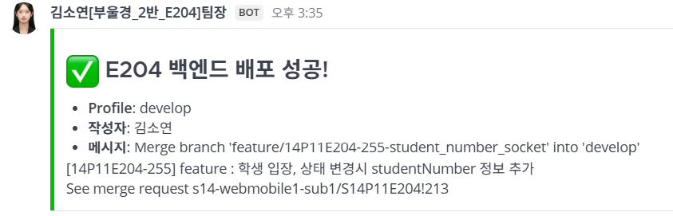</td>
  </tr>
  <tr>
    <td align="center" width="50%"><b>🗨️ Jira Issue Notification</b></td>
    <td align="center" width="50%"><b>🔀 Merge Request Created Notification</b></td>
  </tr>
  <tr>
    <td align="center">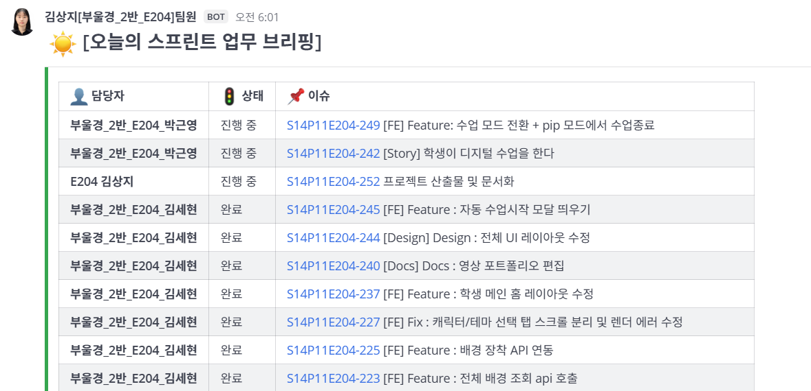</td>
    <td align="center"></td>
  </tr>
</table>

</div>

<br>

## 📲 기능 구성

<a name="skills"></a>

<div align="center">

<table>
  <tbody align="center"> 
    <tr> <th style="text-align: center"> [선생님 화면] 수업 시작 </th> <th style="text-align: center"> [학생 화면] 수업 시작 </th> </tr>
    <tr> <td width="50%">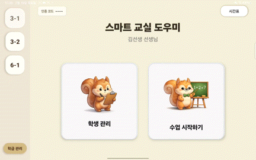</td> 
        <td width="50%"></td> </tr> </tbody>
  <tbody align="center"> 
    <tr> <th style="text-align: center"> [선생님 화면] 이탈 알림 </th> <th style="text-align: center"> [학생 화면] 이탈 알림 </th> </tr>
    <tr> <td width="50%">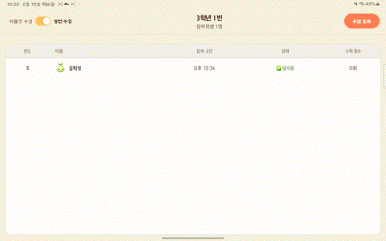</td>
    <td width="50%"></td> </tr> </tbody>
  <tbody align="center"> 
    <tr> <th style="text-align: center"> [선생님 화면] 발표&화장실 알림 </th> <th style="text-align: center"> [학생 화면] 발표&화장실 알림 </th> </tr>
    <tr> <td width="50%">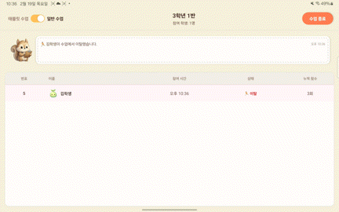</td>
    <td width="50%"></td> </tr>
  </tbody>
  <tbody align="center"> 
    <tr> <th style="text-align: center"> [선생님 화면] 수업 종료 </th> <th style="text-align: center"> [학생 화면] 수업 종료 </th> </tr>
    <tr> <td width="50%"></td>
    <td width="50%"></td> </tr>
  </tbody>
  <tbody align="center"> 
    <tr> <th style="text-align: center"> [선생님 화면] 경험치 수정 </th> <th style="text-align: center"> [선생님 화면] 통계 대시보드 </th> </tr>
    <tr> <td width="50%"></td>
    <td width="50%">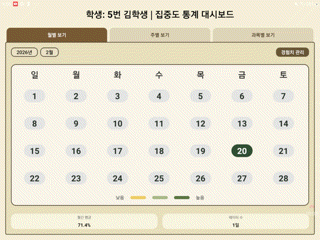</td> </tr>
  </tbody>
</table>
</div>
<br>

## 📂 디렉터리 구조

<a name="directories"></a>

### 🌕 Frontend

<details align="left">
  <summary>
    <strong>Frontend</strong>
  </summary>

```
📦frontend
 ┣ 📂.expo
 ┣ 📂android
 ┃ ┣ 📂app
 ┃ ┃ ┗ 📂src
 ┃ ┃ ┃ ┗ 📂main
 ┃ ┃ ┃ ┃ ┗ 📂assets
 ┃ ┃ ┃ ┃ ┃ ┣ 📂java
 ┃ ┃ ┃ ┃ ┃ ┃ ┗ 📂com
 ┃ ┃ ┃ ┃ ┃ ┃ ┃ ┗ 📂my
 ┃ ┃ ┃ ┃ ┃ ┃ ┃ ┃ ┗ 📂icethang
 ┃ ┃ ┃ ┃ ┃ ┃ ┃ ┃ ┃ ┣ 📜MainActivity.kt
 ┃ ┃ ┃ ┃ ┃ ┃ ┃ ┃ ┃ ┗ 📜MainApplication.kt
 ┃ ┃ ┃ ┃ ┃ ┗ 📜face_landmarker.tflite
 ┣ 📂app
 ┃ ┣ 📂api
 ┃ ┣ 📂components
 ┃ ┃ ┣ 📂ai
 ┃ ┃ ┣ 📂AlertButton
 ┃ ┃ ┣ 📂AutoLessonStartProvider
 ┃ ┃ ┣ 📂Calibration
 ┃ ┃ ┣ 📂ClassProgressBar
 ┃ ┃ ┣ 📂ClassScreenLayout
 ┃ ┃ ┣ 📂ExpBarㄸ
 ┃ ┃ ┣ 📂LevelUp
 ┃ ┃ ┣ 📂Menu
 ┃ ┃ ┣ 📂RewardModal
 ┃ ┃ ┣ 📂StudyStartModal
 ┃ ┃ ┣ 📂TrafficLight
 ┃ ┃ ┣ ⚛️ClassResultModal.tsx
 ┃ ┃ ┗ ⚛️LevelUpRewardModal.tsx
 ┃ ┣ 📂constants
 ┃ ┣ 📂context
 ┃ ┣ 📂screens
 ┃ ┃ ┣ 📂_layout.tsx
 ┃ ┃ ┣ 📂Change_Theme
 ┃ ┃ ┣ 📂Classtime_Digital
 ┃ ┃ ┣ 📂Classtime_Normal
 ┃ ┃ ┣ 📂Select
 ┃ ┃ ┣ 📂SignUp
 ┃ ┃ ┣ 📂Student_Home
 ┃ ┃ ┣ 📂Student_Loading
 ┃ ┃ ┣ 📂Student_Login
 ┃ ┃ ┣ 📂Teacher_ChildManage
 ┃ ┃ ┣ 📂Teacher_Lesson
 ┃ ┃ ┣ 📂Teacher_Login
 ┃ ┃ ┣ 📂Teacher_MainPage
 ┃ ┃ ┣ 📂Teacher_Statistics
 ┃ ┃ ┗ 📂Teacher_TimeTable
 ┃ ┣ 📂services
 ┃ ┣ 📂store
 ┃ ┃ ┣ 📂slices
 ┃ ┃ ┣ 📜hooks.ts
 ┃ ┃ ┗ 📜stores.ts
 ┃ ┣ 📂utils
 ┃ ┣ ⚛️_layout.tsx
 ┃ ┣ ⚛️index.tsx
 ┃ ┣ ⚛️Teacher_ChildManage.tsx
 ┃ ┗ ⚛️Teacher_Statistics.tsx
 ┣ 📂assets
 ┃ ┣ 📂animations
 ┃ ┣ 📂characters
 ┃ ┣ 📂font
 ┃ ┣ 📂themes
 ┃ ┗ 🖼️.png
 ┣ 📂node_modules
 ┣ 📂patches
 ┣ 📂TIL
 ┣ 📜.easignore
 ┣ 📜.env
 ┣ 📜.gitignore
 ┣ 📜babel.config.js
 ┣ 📜cesconfig.jsonc
 ┣ 📜docker-compose.yml
 ┣ 📜eslint.config.js
 ┣ 📜global.css
 ┣ 📜Jenkinsfile
 ┣ 📜metro.config.js
 ┣ 📜nativewind-env.d.ts
 ┣ 📜package-lock.json
 ┣ 📜package.json
 ┣ 📜prettier.config.js
 ┣ 📜tailwind.config.js
 ┗ 📜tsconfig.json
```

</details>

### 🌑 Backend

<details align="left">
  <summary>
    <strong>Backend</strong>
  </summary>

```
📦backend
 ┣ 📂src
 ┃ ┣ 📂main
 ┃ ┃ ┣ 📂java
 ┃ ┃ ┃ ┗ 📂com
 ┃ ┃ ┃ ┃ ┗ 📂ssafy
 ┃ ┃ ┃ ┃ ┃ ┗ 📂icethang
 ┃ ┃ ┃ ┃ ┃ ┃ ┣ 📂domain
 ┃ ┃ ┃ ┃ ┃ ┃ ┃ ┣ 📂auth
 ┃ ┃ ┃ ┃ ┃ ┃ ┃ ┃ ┣ 📂controller
 ┃ ┃ ┃ ┃ ┃ ┃ ┃ ┃ ┣ 📂dto
 ┃ ┃ ┃ ┃ ┃ ┃ ┃ ┃ ┣ 📂entity
 ┃ ┃ ┃ ┃ ┃ ┃ ┃ ┃ ┣ 📂repository
 ┃ ┃ ┃ ┃ ┃ ┃ ┃ ┃ ┗ 📂service
 ┃ ┃ ┃ ┃ ┃ ┃ ┃ ┣ 📂classgroup
 ┃ ┃ ┃ ┃ ┃ ┃ ┃ ┃ ┣ 📂controller
 ┃ ┃ ┃ ┃ ┃ ┃ ┃ ┃ ┣ 📂dto
 ┃ ┃ ┃ ┃ ┃ ┃ ┃ ┃ ┣ 📂entity
 ┃ ┃ ┃ ┃ ┃ ┃ ┃ ┃ ┣ 📂repository
 ┃ ┃ ┃ ┃ ┃ ┃ ┃ ┃ ┗ 📂service
 ┃ ┃ ┃ ┃ ┃ ┃ ┃ ┣ 📂monitoring
 ┃ ┃ ┃ ┃ ┃ ┃ ┃ ┃ ┣ 📂controller
 ┃ ┃ ┃ ┃ ┃ ┃ ┃ ┃ ┣ 📂dto
 ┃ ┃ ┃ ┃ ┃ ┃ ┃ ┃ ┣ 📂entity
 ┃ ┃ ┃ ┃ ┃ ┃ ┃ ┃ ┣ 📂repository
 ┃ ┃ ┃ ┃ ┃ ┃ ┃ ┃ ┗ 📂service
 ┃ ┃ ┃ ┃ ┃ ┃ ┃ ┣ 📂schedule
 ┃ ┃ ┃ ┃ ┃ ┃ ┃ ┃ ┣ 📂controller
 ┃ ┃ ┃ ┃ ┃ ┃ ┃ ┃ ┣ 📂dto
 ┃ ┃ ┃ ┃ ┃ ┃ ┃ ┃ ┣ 📂entity
 ┃ ┃ ┃ ┃ ┃ ┃ ┃ ┃ ┣ 📂repository
 ┃ ┃ ┃ ┃ ┃ ┃ ┃ ┃ ┗ 📂service
 ┃ ┃ ┃ ┃ ┃ ┃ ┃ ┣ 📂statistics
 ┃ ┃ ┃ ┃ ┃ ┃ ┃ ┃ ┣ 📂controller
 ┃ ┃ ┃ ┃ ┃ ┃ ┃ ┃ ┣ 📂dto
 ┃ ┃ ┃ ┃ ┃ ┃ ┃ ┃ ┃ ┗ 📂response
 ┃ ┃ ┃ ┃ ┃ ┃ ┃ ┃ ┗ 📂service
 ┃ ┃ ┃ ┃ ┃ ┃ ┃ ┣ 📂student
 ┃ ┃ ┃ ┃ ┃ ┃ ┃ ┃ ┣ 📂controller
 ┃ ┃ ┃ ┃ ┃ ┃ ┃ ┃ ┣ 📂dto
 ┃ ┃ ┃ ┃ ┃ ┃ ┃ ┃ ┣ 📂entity
 ┃ ┃ ┃ ┃ ┃ ┃ ┃ ┃ ┣ 📂repository
 ┃ ┃ ┃ ┃ ┃ ┃ ┃ ┃ ┗ 📂service
 ┃ ┃ ┃ ┃ ┃ ┃ ┃ ┣ 📂theme
 ┃ ┃ ┃ ┃ ┃ ┃ ┃ ┃ ┣ 📂controller
 ┃ ┃ ┃ ┃ ┃ ┃ ┃ ┃ ┣ 📂dto
 ┃ ┃ ┃ ┃ ┃ ┃ ┃ ┃ ┣ 📂entity
 ┃ ┃ ┃ ┃ ┃ ┃ ┃ ┃ ┣ 📂repository
 ┃ ┃ ┃ ┃ ┃ ┃ ┃ ┃ ┗ 📂service
 ┃ ┃ ┃ ┃ ┃ ┃ ┃ ┗ 📂timetable
 ┃ ┃ ┃ ┃ ┃ ┃ ┃ ┃ ┣ 📂controller
 ┃ ┃ ┃ ┃ ┃ ┃ ┃ ┃ ┣ 📂dto
 ┃ ┃ ┃ ┃ ┃ ┃ ┃ ┃ ┣ 📂entity
 ┃ ┃ ┃ ┃ ┃ ┃ ┃ ┃ ┣ 📂repository
 ┃ ┃ ┃ ┃ ┃ ┃ ┃ ┃ ┗ 📂service
 ┃ ┃ ┃ ┃ ┃ ┃ ┗ 📂global
 ┃ ┃ ┃ ┃ ┃ ┃ ┃ ┣ 📂common
 ┃ ┃ ┃ ┃ ┃ ┃ ┃ ┣ 📂config
 ┃ ┃ ┃ ┃ ┃ ┃ ┃ ┣ 📂controller
 ┃ ┃ ┃ ┃ ┃ ┃ ┃ ┣ 📂exception
 ┃ ┃ ┃ ┃ ┃ ┃ ┃ ┣ 📂redis
 ┃ ┃ ┃ ┃ ┃ ┃ ┃ ┣ 📂security
 ┃ ┃ ┃ ┃ ┃ ┃ ┃ ┗ 📂utill
 ┃ ┃ ┃ ┃ ┃ ┗ ☕IcethangApplication
 ┃ ┗ 📂test
 ┣ 📜.gitattributes
 ┣ 📜.gitignore
 ┣ 📜build.gradle.kts
 ┣ 📜deploy.sh
 ┣ 📜Dockerfile
 ┣ 📜gradlew
 ┣ 📜gradlew.bat
 ┗ 📜settings.gradle.kts
```

</details>
<br>

## 📦 프로젝트 산출물

<a name="projectDeliverables"></a>

<h3><a href="https://youtu.be/5AmrbxufGHA" target="_blank">📹 Icethang Portfolio</a></h3>
<div align="center">

<a href="https://youtu.be/5AmrbxufGHA" target="_blank"></a>

</div>

<h3>🖼️ 화면 설계서</h3>
<div align="center">

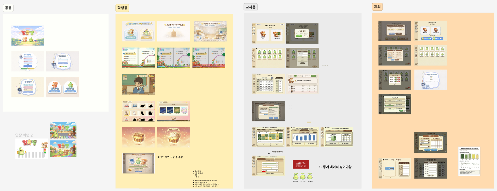
</div>

<h3>🗄️ ERD</h3>
<div align="center">

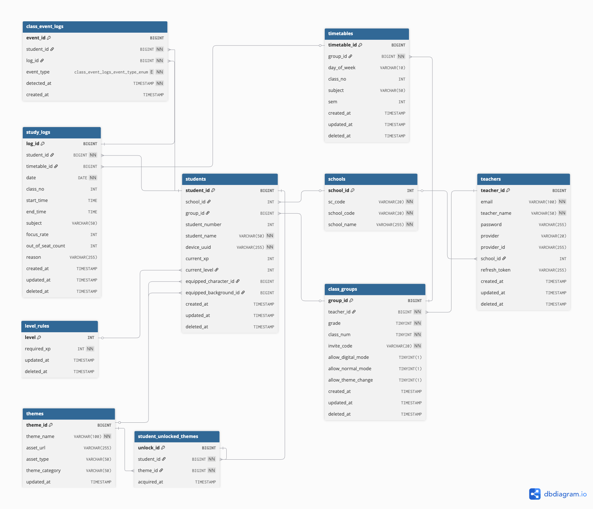
</div>

<h3>📅 Jira Issues</h3>
<details align="left">
  <summary>
    <strong>자세히</strong>
  </summary>

  <div align="center">

  
  </div>
</details>

<h3><a href="https://abalone-promotion-4f1.notion.site/2e816a5891e080799f9ceb197141e669" target="_blank">📋 기능 명세서</a></h3>
<details align="left">
  <summary>
    <strong>자세히</strong>
  </summary>
  <div align="center">

<a href="https://www.notion.so/24276be4587d80a78d1ad824a9c825fe" target="_blank">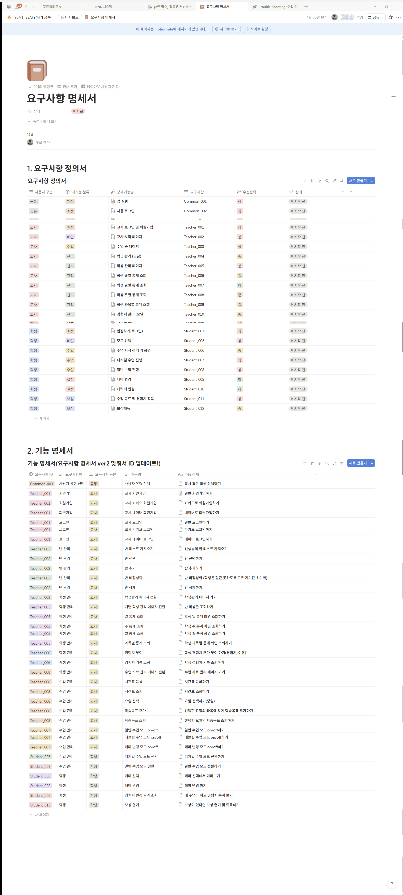</a>

  </div>

</details>

<h3><a href="https://abalone-promotion-4f1.notion.site/API-2e916a5891e080dfb50ccc7e574ee9bb?pvs=74" target="_blank">📡 API 명세서</a></h3>
<details align="left">
  <summary>
    <strong>자세히</strong>
  </summary>
  <div align="center">

<a href="https://www.notion.so/API-22a76be4587d802cb7fed72fd1e93204" target="_blank">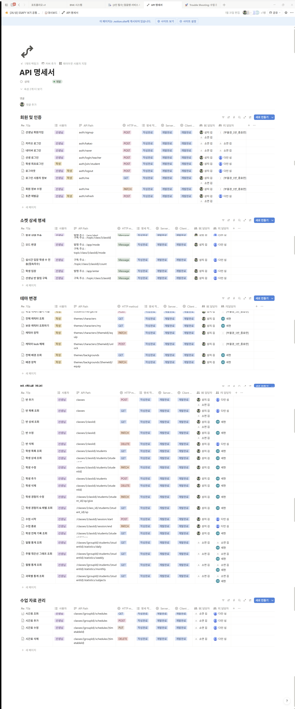</a>

  </div>

</details>
