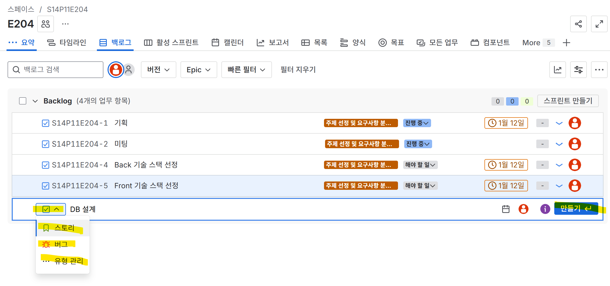
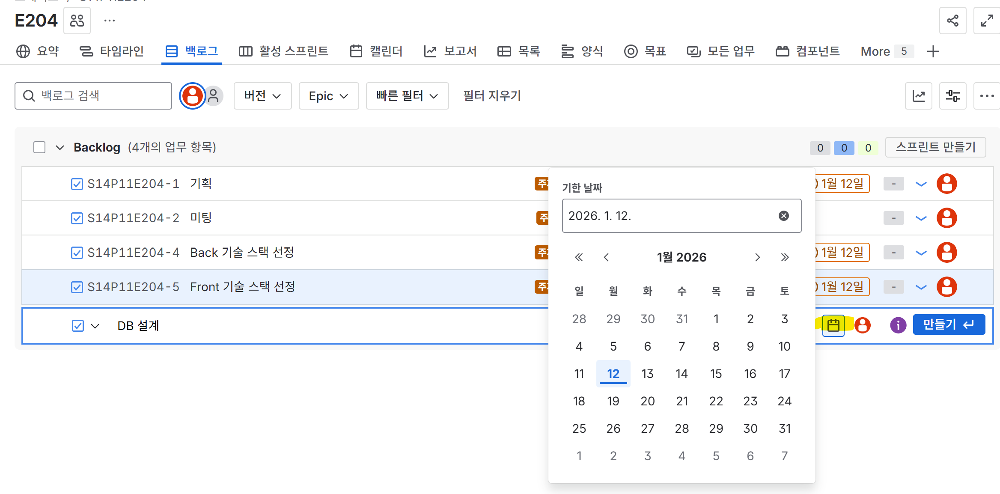
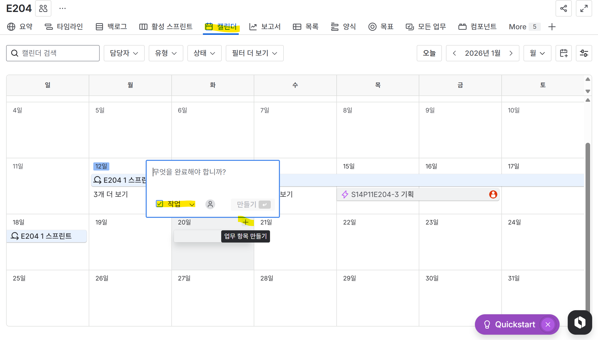

## Jira convention 설계

### 주의할 점(중요)

1. 이슈 생성 후 삭제하면 이슈번호를 되돌릴 수 없다.(3번 지우면 4번이 3번이되고 그런것 불가능)

   따라서 신중하게 이슈를 생성해야함

2. 스프린트 하나를 다해야 다음 스프린트 생성할 수 있으므로 하나의 스프린트 내에 생성한 이슈는 기한 내에 완료하기(완료 눌러주기)
3. 백로그에서 이슈 생성 후 현재 스프린트에 해당 될 경우(==이번 주 작업에 해당될 경우) 스프린트에 올려놓기
4. **편집**해야할 경우 목록이나 백로그에서 해당 이슈 블록 체크박스 체크 후 아래 필드 편집 혹은 편집 이용하기
5. 이슈 기한 같은 경우 캘린더에서 늘리기, 줄이기 사용하기

### 1. 이슈 유형 (Issue Types)

- **🟣 에픽 (Epic):** 큰 프로젝트 단위나 카테고리 == issue의 대분류
    - story 와 task로 구성
    - *예: `[기획]`, `[회원가입]`, `[게시판]`*
    - **🟢 스토리 (Story):** **사용자** 관점의 기능 개발 단위
        - 보통 pm이 작성
        - 스토리의 sub-task는 각 기능 개발/디자이너가 작성
            - *예: `로그인 페이지 퍼블리싱`, `소셜 로그인 API 연동`*
    - **🔵 작업 (Task):** **개발 외적**인 업무나 기술적 세팅
        - 스토리를 지원하는 기술/관리적인 업무
        - Task의 Sub-Task는 각 기능 개발/디자이너가 작성
            - *예: `DB 설계`, `회의록 정리`, `서버 배포 설정`* `AWS 서버 구축 및 배포 환경 세팅` `데이터베이스 스키마 설계` ,`오픈소스 라이브러리 조사 및 적용` ,`팀 기술 문서(Wiki) 작성`
    - **🔴 버그 (Bug):** 오류 수정
        - *예: `로그인 시 404 에러 해결`*

- 💎 **서브 태스크 (Sub-task)** : 가장 막내
    - *스토리, 태스크, 버그의 하위 작업*

      예시)

      **Task:** **메인 페이지 와이어프레임 제작** (결과물)

        - Sub-task: 상단 헤더(GNB) 배치 구상
        - Sub-task: 추천 여행지 리스트 UI 스케치
        - Sub-task: 피그마로 옮기기


---
### 2. 워크플로우 (Workflow)

지라 보드의 상태값은 아래 규칙에 따라 이동

1. **해야 할 일 (To Do):** 아직 시작 안 함. (스프린트에 등록된 상태)
2. **진행 중 (In Progress):** 하고있는 일**.** (한 사람당 1~2개만 유지)
3. **완료 (Done):** 개발 완료 + 테스트 완료 +(머지완료)

---

### 3. 이슈 만들기

1. 이슈(업무) 유형 정하기
2. 이슈 명 작성하기
3. 이슈 기한 정하기
4. 이슈 스토리 포인트 정하기
5. 작업하며 `진행중` 으로 바꾸기
6. 작업 완료 후 `완료` 로 바꾸기

- 백로그에서 만들기 참고

  > 백로그에서 만들기 후 구성 설정
  >
  
  > 백로그 → 만들기
  >
  
  > 이슈 유형 선택 및 이슈 생성
  >

  > 날짜 꼭 설정하기!!! (나중에 수정이 안됨 ㅠㅠ)


- 스토리 포인트 작성하기

- 캘린더에서 만들기 참고
    1. +버튼 눌러서 작업 업무 형태 정하기
    2. 스토리 포인트 (1 3 5 8) 중 업무 난이도 고르기
    3. 작업명 혹은 스토리명 혹은 버그명 작성 후 만들기


### 4. Linked issues 유형 및 사용

- 사용 tip
1. 수동/능동 관계들은 둘 중에 하나만 설정하면 반대쪽은 자동으로 생김

   → 따라서 하나만 설정하면됨

2. 워크플로우 상태가 이미 ‘완료’이면 연결할 수 없으니 ‘진행중’일때

상황 1 : 작업의 선후 관계가 있을때 or 내 작업의 선후 관계가 꼬여서 팀원한테 독촉하고 싶을때

`is blocked by`

```jsx
- A is blocked by B
"B 작업 빨리 해주삼"
"B를 해야만 A 할 수 있음"
```

상황 2 : 똑같은 기능 하는데 환경만 다를때

`is cloned by`

```jsx
- A is cloned by B
"버그가 생겼는데 (ios)B에서도 고쳐야하고 (안드로이드)A에서도 고쳐야함 
```

상황 3 : jira 들어갔는데 내가 이미 한 작업을 다른사람이 새 이슈를 파서 시작하려고 할때

`is duplicated by`

```jsx
- A is duplicated by B
"A 작업이 현재 있는 B랑 중복되었어요 닫힘처리해야해요"
```

상황 4 : 작업이 너무 커서 조각내서 처리할때

`split from`

```jsx
- A split from B
A 작업을 생성했는데 B작업에서 나온 작업일때
"관리자 페이지 만들기(B) 라는 작업을 이미 만들었는데 하다보니까 
회원관리랑 게시글 관리 등등 너무 많을때 회원관리(A)라는 작업을 만들었다고 표시해야할때 
```

상황 5 : 이 작업 참고해서 하라고 하고싶을때

`is caused by` ,`relates to`

```jsx

- A implememtes B
안쓰일듯 쓰지말기^^ 

- A is caused by B
B오류 고치려고 하니까 저번에 작업한 A때문인걸 발견했을때

- A relates to B
A작업 할건데 B랑 코드가 비슷해서 참고할때 혹은 일반 참고
```
---
## DB 설계  
- **DB 1차**
  - [x]  학생 
     - 디지털 수업 모드 전환(윈도우매니저로 최상단에 마라톤 테마 띄우기)
     - 일반 수업 모드 전환(요일에 맞는 시간표 표시, 시간에 맞는 시간표 과목 표시, 이탈 감지시 이탈 감지 문구 띄우기, 사용자 안전벨트 띄우기, 신호등 띄우기)
     - 테마 변경 화면
  - [x]  선생님
      - 사이드바(반)
      - 학생 관리(학생 등록, 학생당 통계내용 확인, 경험치 추가 부여)
          - 통계 보여주는 단위(일, 주, 월)
          - 1교시에 몇분동안 집중했는지, 안일어났는지,
      - 자료 등록(시간표 등록 및 보기, 날짜당 시간표 표시 및 n교시 당 학습목표 저장)


- **DB 2차 수정(피그마 회의 이후)**
  - [x]  원격 모드 제어 → group 테이블에 boolean으로 필드 추가
  allow_digital_mode : 디지털 수업 버튼 잠금 해제
    allow_normal_mode : 일반 수업 버튼 잠금 해제
    allow_theme_change : 테마 변경 버튼 잠금 해제

  - [x]  테마를 캐릭터와 배경으로 나누기 + 배경은 그냥 다 나타내기
  theme_type 컬럼 추가하기
  students 테이블에 캐릭터, 배경 id값으로 나누기
  unlock테이블에는 캐릭터만 저장하기