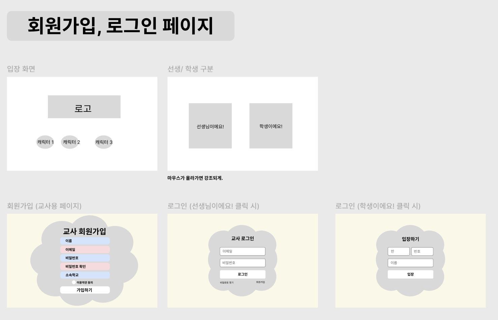
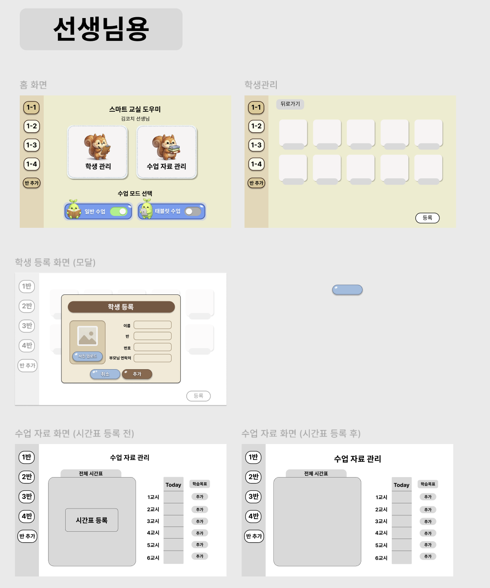
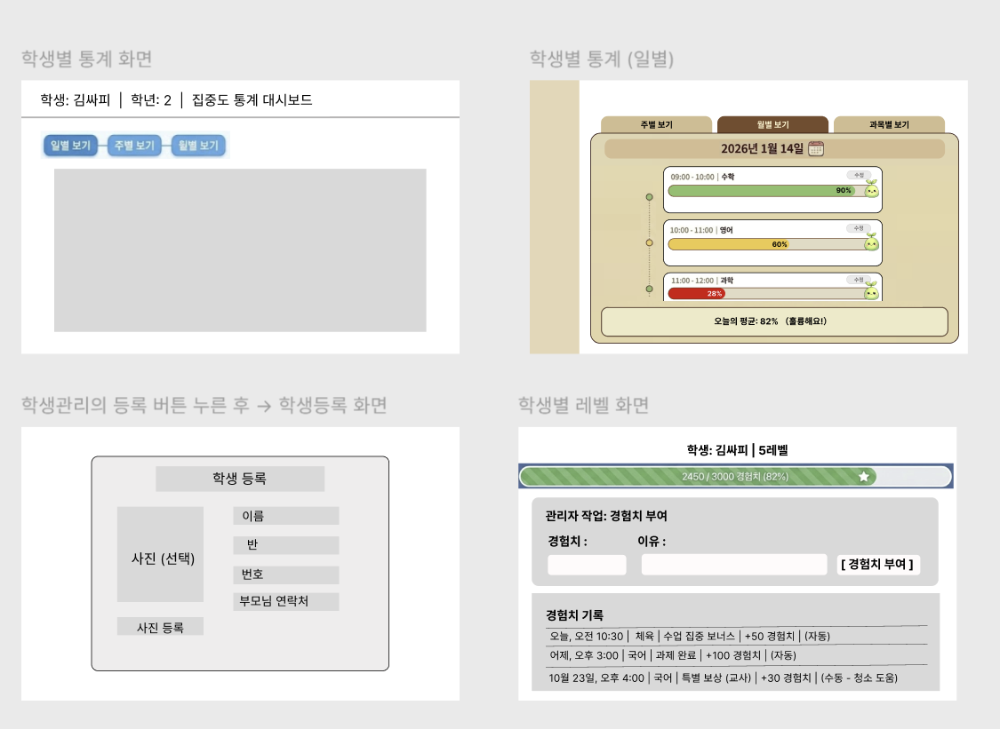
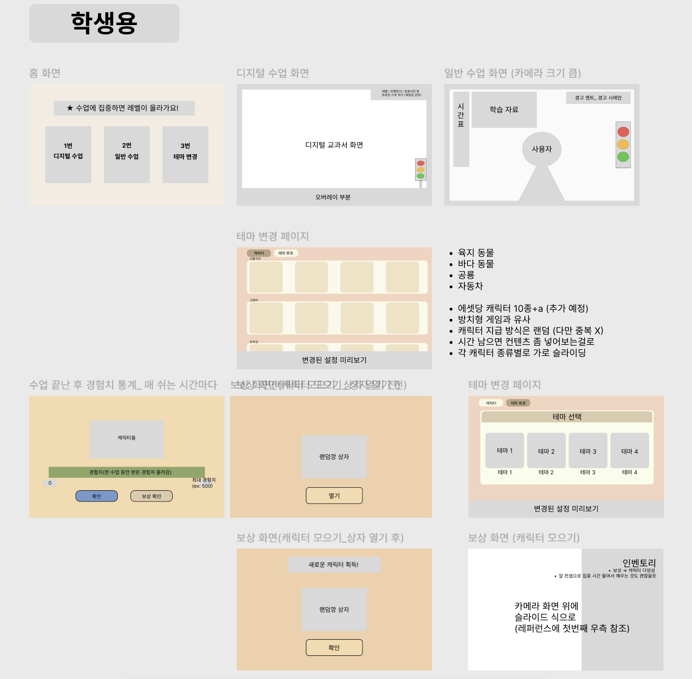
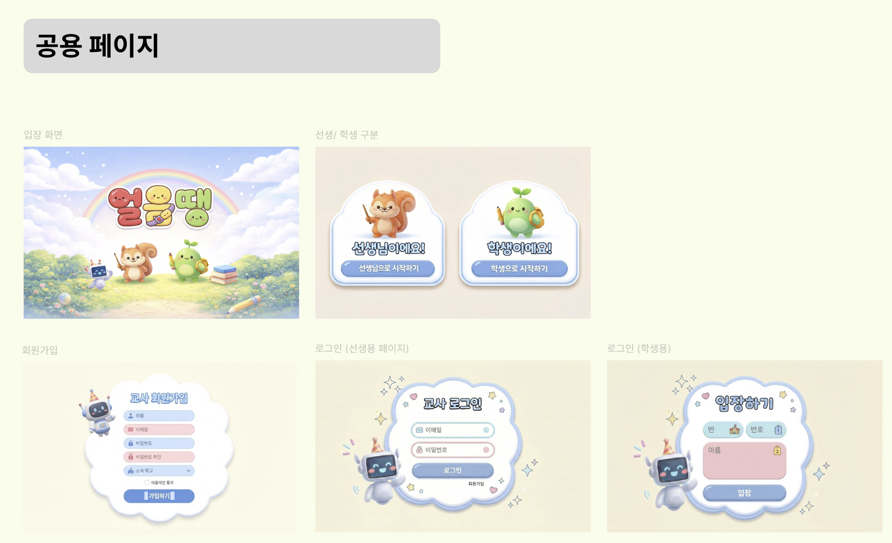
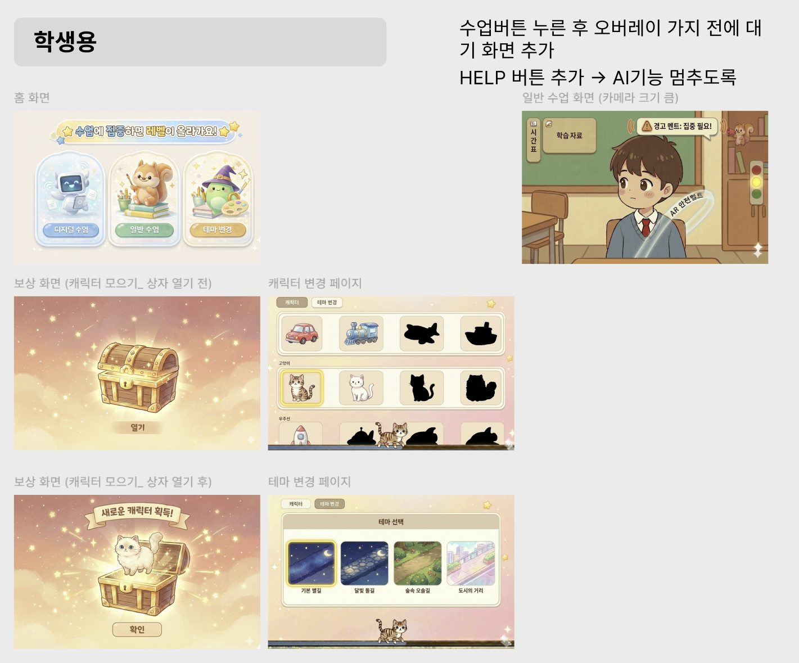
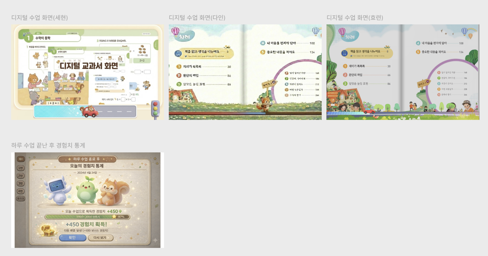
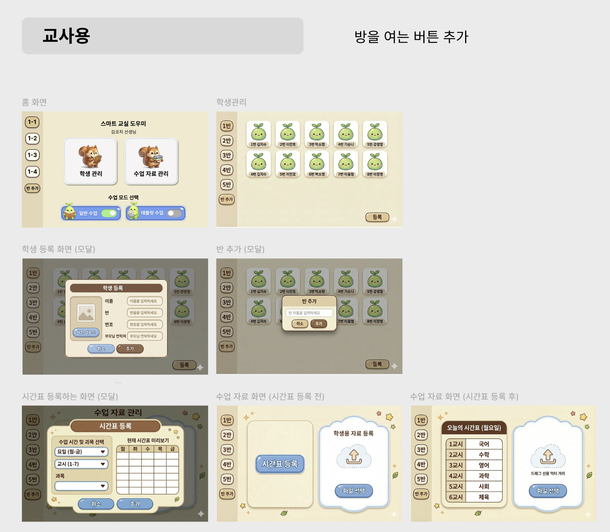
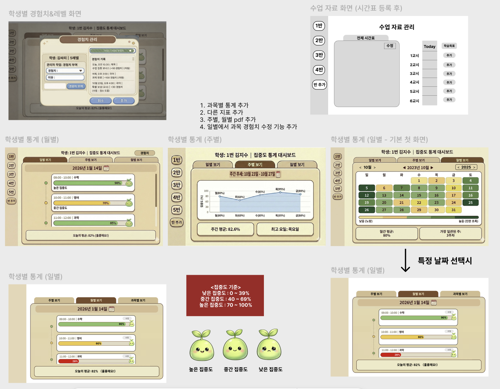

## UI / UX Design (Figma Mockup)
본 프로젝트의 UI/UX는 Figma를 활용해 전반적인 화면 흐름부터 세부 인터랙션까지 직접 설계했습니다.

단순한 화면 나열이 아닌, **실제 사용자 사용 흐름(User Flow)**을 기준으로 목업을 구성했습니다.

## 디자인 목표
- 집중을 방해하지 않는 UI
- 초등학생도 직관적으로 이해할 수 있는 화면 구성
- 선생님과 학생의 역할이 명확히 구분되는 UX
- 실시간 상태 변화를 시각적으로 즉시 인지 가능

## 주요 화면 구성
### 1️⃣ 홈 화면
- 오늘의 수업 상태를 한눈에 확인
- 캐릭터를 중심으로 현재 상태를 직관적으로 표현
- 불필요한 버튼을 최소화하여 초기 진입 부담 감소

    👉 앱 실행 직후 사용자가 고민하지 않도록 설계

### 2️⃣ 수업 중 화면 (핵심 화면)
- 신호등 UI를 중심으로 현재 집중 상태를 시각화
- 화면 우측 상단에 최소한의 UI만 배치하여
    
    => 수업 자료를 가리지 않도록 설계

- 상태 변화는 색상 + 애니메이션으로 즉시 인지 가능

    👉 아이들이 “지금 내가 어떤 상태인지” 말 없이도 이해하도록 설계

### 3️⃣ 이벤트 / 개입 화면
- 시스템이 감지한 이벤트를 **카드 형태로 표현**

    👉 실제 수업 흐름을 끊지 않는 UX를 목표로 설계

### 4️⃣ 수업 종료 & 통계 화면
- 하루 수업이 끝난 후 집중 시간, 상태 변화 빈도, 경험치 / 레벨 등을 시각적으로 요약
- 그래프 + 캐릭터 반응을 통해 아이들의 흥미 유도

    👉 “혼났는지”가 아니라 “얼마나 잘했는지”를 보여주는 구조

## 디자인 특징
- 컬러 중심 UX
- 초록 / 노랑 / 빨강 → 말하지 않아도 상태 인지
- 텍스트 최소화
- 아이들이 읽지 않아도 이해 가능한 UI
- 캐릭터 중심 인터페이스
- 감정 전달과 피드백을 캐릭터로 표현

### 실제 작업 사진

---

