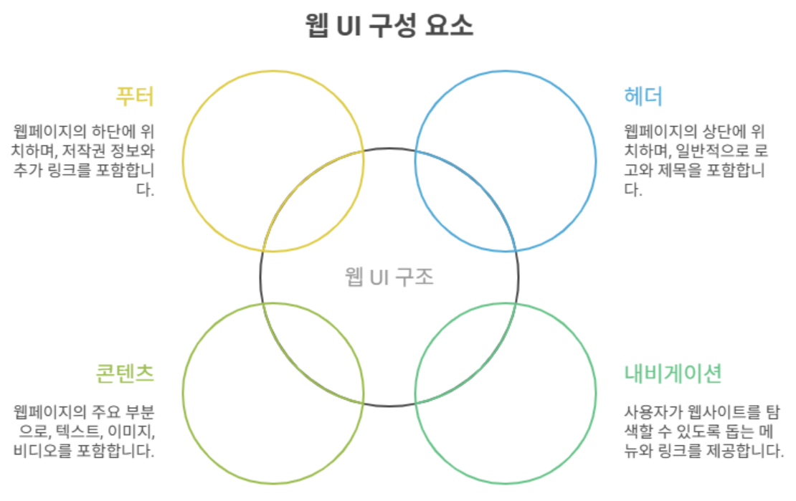
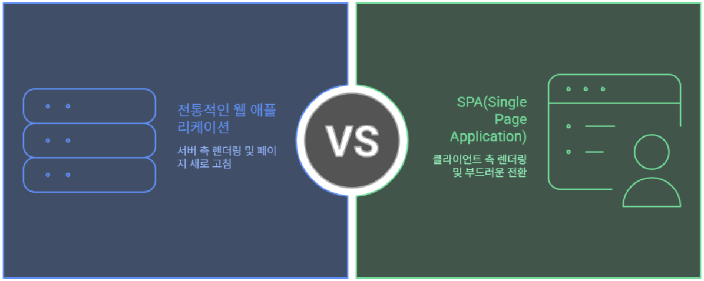

## 1. 들어가며

- 우리는 보통 인터넷 브라우저를 열고, 원하는 주소를 입력하거나 검색을 통해 들어갑니다. 
- 화면에 글, 사진, 버튼, 입력창 등이 보이고, 우리는 이를 통해 다양한 작업을 합니다. 
- 바로 이 화면에 보이는 것들을 **웹 사용자 인터페이스(Web UI)**

## 2. 웹 UI란 무엇인가?

- **웹 UI(User Interface)** 는 말 그대로 사용자가 웹 애플리케이션과 상호작용하기 위해 사용하는 **화면 요소**를 말합니다.

- 웹 UI 구성요소
    - **레이아웃(Layout)**: 화면의 전체적인 배치 구조
    - **네비게이션(Navigation)**: 메뉴, 링크, 이동 버튼
    - **컨트롤(Control)**: 버튼, 입력 필드, 체크박스 등
    - **정보 표시 영역**: 표, 차트, 이미지, 텍스트

    

- 웹 UI는 단순히 디자인이 아니라, 사용자가 **어떻게 데이터를 입력하고, 어떻게 결과를 확인할 것인지**를 정의하는 핵심 요소입니다.

## 3. 전통적인 웹 애플리케이션 구조
- 과거의 웹사이트는 서버 중심의 구조를 가졌습니다. 
- 사용자가 어떤 버튼을 누르거나 페이지를 이동할 때마다 서버에 새로운 요청을 보냈고, 서버는 완전히 새로운 HTML 문서를 브라우저에 내려주었습니다.

- 이 방식은 단순하고 이해하기 쉽지만, 문제가 많았음!!
    - 화면이 바뀔 때마다 **전체 페이지가 새로고침**되며 깜빡거림.
    - 불필요하게 많은 HTML을 계속 전송하기 때문에 **속도가 느림**.
    - 사용자가 한 번 입력한 정보가 사라지는 등 **경험(UX)**이 불편했음.

## 4. SPA(Single Page Application)의 등장
- 이러한 불편함을 해결하기 위해 등장한 개념이 **SPA(Single Page Application)**
- SPA는 말 그대로 "**단일 페이지 애플리케이션**"이라는 뜻으로, 웹 애플리케이션이 하나의 HTML 페이지 위에서 동작
- 즉, 초기에 한 번만 HTML/CSS/JS 파일을 로딩한 뒤, 이후에는 **필요한 데이터만 서버에서 받아와서 화면의 일부만 갱신**하는 방식

    > ex) 메일을 클릭할 때마다 전체 화면이 새로 로딩되지 않고, 왼쪽 메뉴는 그대로 둔 채 오른쪽의 내용만 바뀌는 것을 볼 수 있음. 

### SPA의 장점

- **빠른 화면 전환**: 전체 새로고침이 없으니 속도가 매우 빠름.
- **부드러운 사용자 경험**: 화면이 끊김 없이 연결되어 마치 데스크톱 앱처럼 느껴짐.
- **재사용 가능한 UI 구조**: 컴포넌트 단위로 UI를 설계할 수 있음.

### SPA의 단점
- 초기 로딩 속도가 무거움. (JS 파일이 커서 처음 실행이 느릴 수 있음)
- 검색 엔진 최적화(SEO)에 불리할 수 있음.
- 브라우저 히스토리 관리가 복잡함.

## 5. 전통 방식과 SPA의 비교
| 구분 | 전통적인 웹 방식 | SPA 방식 |
|------|------------------|----------|
| 화면 전환 | 전체 페이지 새로고침 | 필요한 부분만 갱신 |
| 속도 | 느림 | 빠름 |
| UX | 끊김, 깜빡임 | 부드럽고 매끄러움 |
| 서버 부하 | HTML 전체 생성 | 데이터만 응답 |
| SEO | 유리 | 불리 |

## 6. SPA를 가능하게 한 기술

- **AJAX (Asynchronous JavaScript and XML)**: 화면을 새로고침하지 않고 서버와 데이터를 주고받을 수 있게 해줌.
- **JSON**: 데이터를 간단하고 가볍게 표현할 수 있는 포맷으로, 서버와 클라이언트 간 교환이 편리함.
- **프론트엔드 프레임워크/라이브러**리: React, Vue, Angular와 같은 도구가 등장하여 SPA 구현이 쉬워짐.