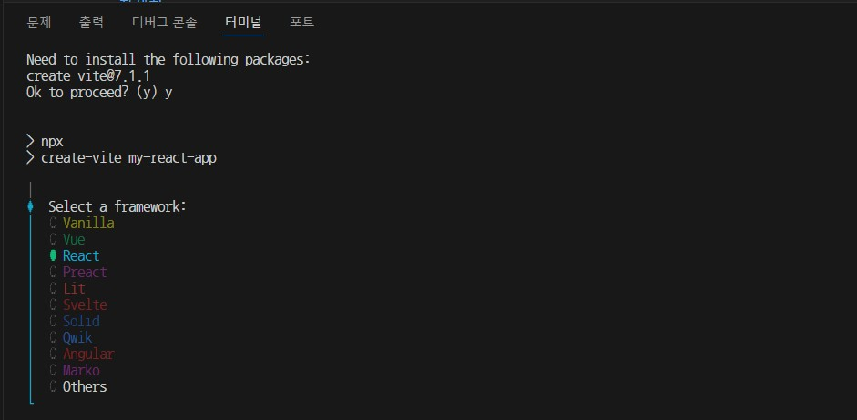

## 🔲 React 개발환경 구성

### 1️⃣ Node.js 설치

#### Node.js란?
- React 프로젝트를 실행하려면 브라우저 외부에서도 자바스크립트를 실행할 수 있는 환경이 필요합니다. 
    - 이 역할을 하는 것이 바로 **Node.js**입니다. 
-  Node.js는 크롬 브라우저의 V8 엔진을 기반으로 만들어진 서버용 자바스크립트 실행 환경입니다. 
- 리액트는 node.js 기반의 라이브러리입니다.
-  React 개발에서는 Node.js가 **빌드 도구 실행, 패키지 설치, 개발 서버 구동** 등의 핵심 역할을 담당합니다.

https://nodejs.org/ko 

---

- React 개발을 위해 Node.js (LTS 버전) 를 설치한다.
- Node.js에는 npm(Node Package Manager) 이 기본으로 포함되어 있다.

설치 확인:
```bash
node -v
npm -v
```

#### LTS 버전 권장
- Node.js에는 **Current(최신 기능)** 과 **LTS(Long-Term Support)** 버전이 있습니다. - React와 같은 실무 프레임워크에서는 안정성과 호환성이 중요한 만큼, LTS 버전을 설치하는 것이 가장 안전합니다.

---

### 2️⃣ React 프로젝트 생성하기

> React 프로젝트를 만들 때 가장 많이 사용하는 두 가지 방법은 **Vite**와 **CRA(Create React App)**입니다.

#### 방법 1) Vite로 생성하기 (추천)
- Vite는 빠른 빌드와 가벼운 개발 서버로 React 학습에 최적화되어 있습니다.

    ```bash
    # 프로젝트 생성
    npm create vite@latest 프로젝트명

    # 템플릿 선택 시
    ✔ Select a framework: › React
    ✔ Select a variant: › JavaScript
    ```

- 프로젝트 생성 명령어를 입력하면,

    

- 위와 같이 Select a framework 에서 React를 선택할 수 있습니다. 그리고 단순 JavaScript를 선택합니다. JavaScript + SWC는 Rust와의 연계가 있습니다.

    ```bash
    # 프로젝트 폴더로 이동 후
    cd my-react-app
    npm install
    npm run dev
    ```


#### 방법 2) CRA로 생성하기 (전통 방식)
- CRA는 오래된 방식이지만 여전히 일부 프로젝트에서 사용됩니다.

    ```bash
    npx create-react-app 프로젝트명
    npm start
    ```

---

3️⃣ 프로젝트 기본 구조
```
react-study/
├─ node_modules/        # 설치된 라이브러리
├─ public/              # 정적 파일
├─ src/
│  ├─ assets/           # 이미지, 아이콘
│  ├─ App.jsx           # 메인 컴포넌트
│  ├─ main.jsx          # 진입 파일
│  └─ index.css         # 전역 스타일
├─ index.html           # HTML 템플릿
├─ package.json         # 프로젝트 설정 및 의존성
└─ vite.config.js       # Vite 설정 파일
```

---

### 4️⃣ React 실행 흐름
```
main.jsx
  ↓
App.jsx
  ↓
컴포넌트 렌더링
  ↓
브라우저 화면 출력
```

---

### 5️⃣ npm start vs npm run dev 차이
- 아무거나 사용하면 안 된다 !!
- 프로젝트 생성 방식에 따라 사용하는 명령어가 다르다.

| 프로젝트 생성 방식             | 개발 서버 실행 명령어  |
| ---------------------- | ------------- |
| Vite + React           | `npm run dev` |
| CRA (Create React App) | `npm start`   |


---

### 6️⃣ 자주 사용하는 명령어 정리
```bash
npm run dev     # 개발 서버 실행
npm run build   # 배포용 빌드
npm run preview # 빌드 결과 미리보기
```