## 1. React의 특징

#### 컴포넌트 기반 개발
- 화면을 작은 블록(컴포넌트) 단위로 쪼개어 관리합니다.

#### 가상 DOM(Virtual DOM)
- 실제 DOM(Document Object Model)을 직접 조작하지 않고, 가상 DOM을 통해 변경사항만 효율적으로 반영합니다.

#### 단방향 데이터 흐름
- 데이터가 부모 → 자식 컴포넌트로 흐르기 때문에 상태 관리가 명확합니다.

#### 풍부한 생태계
- 다양한 라이브러리, 도구, 커뮤니티가 존재하여 확장성이 뛰어납니다.

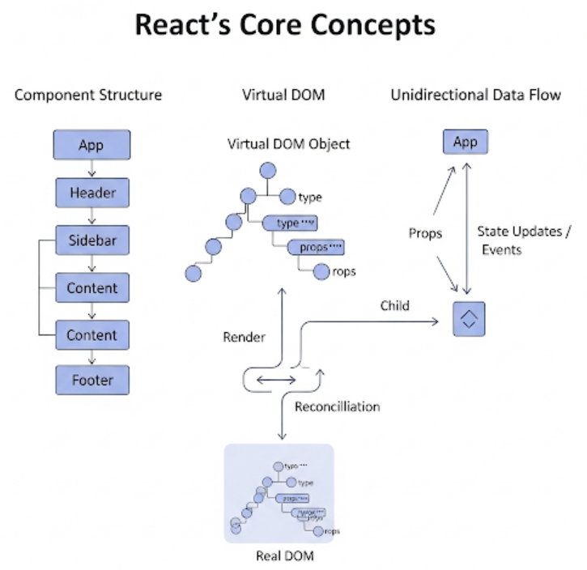


## 2. JSX 문법
- React에서 UI를 표현할 때 사용하는 특별한 문법이 바로 **JSX(JavaScript XML)**
- SX는 HTML처럼 보이지만 실제로는 자바스크립트 코드로 변환됩니다.

### JSX 기본 예시
```jsx
const element = <h1>Hello, React!</h1>;
```

- 이 코드는 브라우저에서 직접 실행되는 HTML이 아니라, 내부적으로 `React.createElement`라는 함수 호출로 변환됩니다.

- App.jsx 모든 소스를 제거하고 아래와 같이 변경합니다.
```jsx
import './App.css'

function App() {
  const element = <h1>Hello, React!</h1>;

  return (
    <>
      <div>
        {element}
      </div>
    </>
  )
}

export default App
```
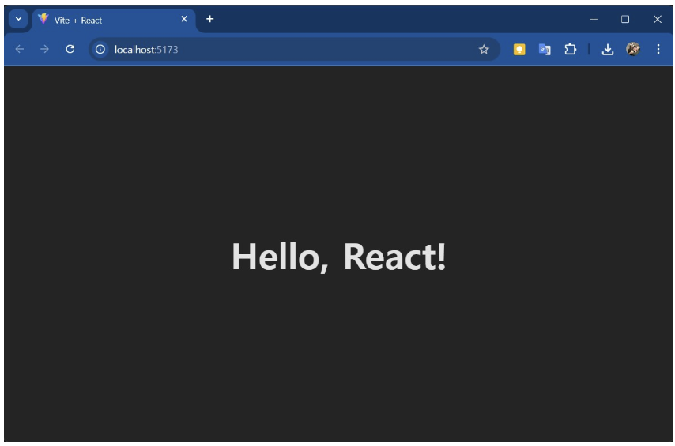

### JSX 규칙
1. 태그는 반드시 닫아야 합니다.
- `` 또는 `<div></div>`

2. 자바스크립트 표현식은 **{ } 중괄호 안**에 넣습니다. 

3. 클래스 속성은 **`className`으로 작성**해야 합니다.

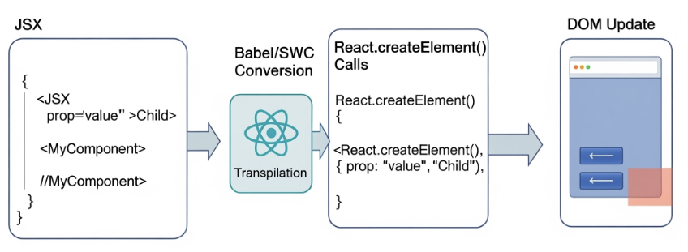


## 3. 함수형 컴포넌트
- React에서 화면을 구성하는 기본 단위 => **컴포넌트**
- 컴포넌트는 말 그대로 UI의 조각으로, 작은 블록을 조립해 큰 화면을 만듭니다.

### 함수형 컴포넌트 예시
```javascript
function Welcome(props) {
  return <h1>Hello, {props.name}!</h1>;
}
```

- 사용할 때는 다음과 같이 작성합니다.
```javascript
<Welcome name="영희" />
<Welcome name="철수" />
```

- 함수형 컴포넌트는 **입력(props) → 출력(UI)** 구조로 동작합니다.
```js
function Welcome(props) {
  return <h1>Hello, {props.name}!</h1>;
}

function App() {

  return (
    <>
      <div>
        <Welcome name="영희" />
        <Welcome name="철수" />
      </div>
    </>
  )
}
```
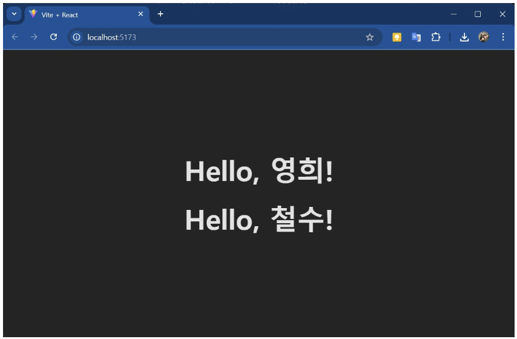
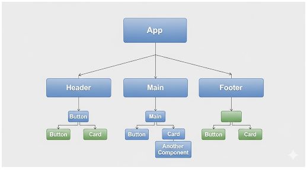


## 4. Props (속성)
- 컴포넌트는 외부에서 데이터를 전달받아 사용할 수 있습니다. 
- 이때 사용하는 것이 **props**

```javascript
function User(props) {
  return <p>사용자 이름: {props.name}</p>;
}
<User name="김민수" />
```

- Props는 읽기 전용 -> 자식 컴포넌트에서 직접 변경할 수 없음!!
- 부모가 내려준 값을 그대로 표시하거나, 이벤트로 부모에게 알리는 방식으로만 동작합니다.

    #### => Props는 재사용성과 확장성을 가능하게 합니다.


## 5. State (상태)
- **State는 컴포넌트 내부에서 관리하는 값**으로, 값이 바뀌면 해당 컴포넌트가 자동으로 다시 렌더링됩니다.

### State 예시
```javascript
import { useState } from "react";

function Counter() {
  const [count, setCount] = useState(0); // 초기값 0

  return (
    <div>
      <p>현재 값: {count}</p>
      <button onClick={() => setCount(count + 1)}>증가</button>
    </div>
  );
}
```
👉 버튼을 클릭하면 setCount가 호출되고, count 값이 증가하면서 UI가 새로 렌더링됩니다.


- 전체 소스는 아래와 같다.
```javascript
import './App.css'
import { useState } from "react";

function Counter() {
  const [count, setCount] = useState(0); // 초기값 0

  return (
    <div>
      <p>현재 값: {count}</p>
      <button onClick={() => setCount(count + 1)}>증가</button>
    </div>
  );
}

function App() {
  return (
    <>
      <div>
        <Counter />
      </div>
    </>
  )
}

export default App
```

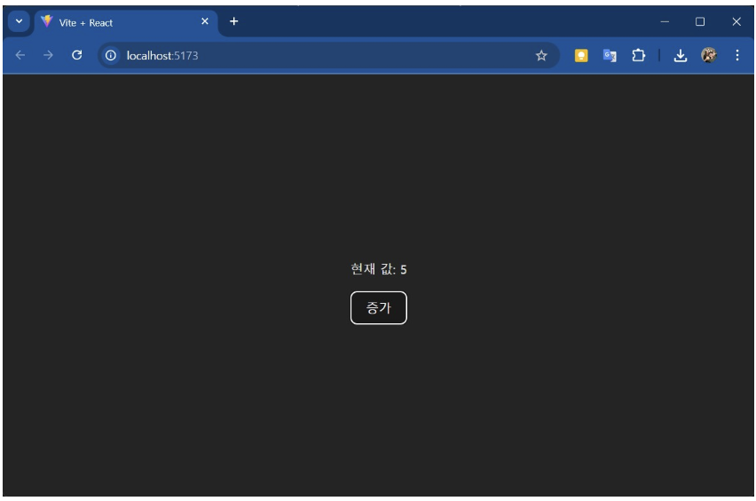
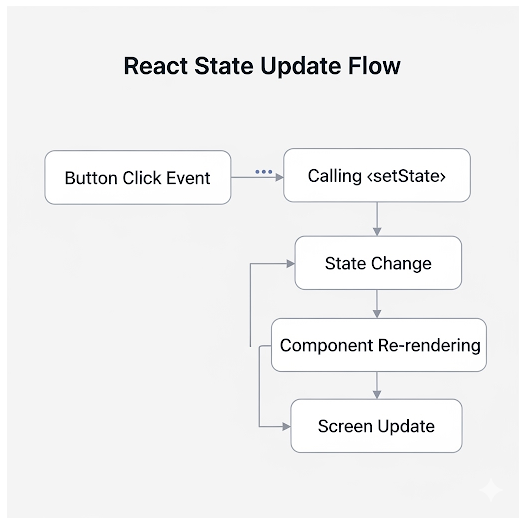


## 6. Props vs State 비교
| 구분 | Props | State |
|------|-------|-------|
| 데이터 출처 | 부모 컴포넌트 | 컴포넌트 내부 |
| 수정 가능 여부 | 읽기 전용 | 변경 가능 |
| 역할 | 외부에서 내려주는 값 | 내부 동적 데이터 |
| 사용 예 | 사용자 이름, 색상, 설정값 | 카운터 값, 입력 필드 값 |

#### 👉 Props와 State를 적절히 조합하면 컴포넌트는 더 강력해집니다.


- **Props**는 **부모 컴포넌트로부터 전달**되고, **읽기전용의 불변**이며, 컴포넌트를 구성하거나 맞춤화하는데 사용되는 반면, 
- **State**는 **컴포넌트 내에서 관리**되고, **변경할 수 있는 가변성질**이며, 시간이 지남에 따라 변하는 데이터에 사용합니다.


## 7. 이벤트 처리
- React에서는 이벤트도 함수로 연결합니다. 
- 주의할 점은 **카멜 케이스**(onClick, onChange)로 작성해야 한다는 것입니다.

```javascript
// ButtonClick 컴포넌트 정의
function ButtonClick() {
  function handleClick() {
    alert("버튼이 클릭되었습니다!");
  }

  return <button onClick={handleClick}>Click me</button>;
}

// App 컴포넌트
function App() {
  return (
    <div>
      <h1>Hello, React!</h1>
      {/* 여기에서 ButtonClick 컴포넌트를 사용 */}
      <ButtonClick />
    </div>
  );
}

export default App;
```
#### 👉 이벤트 객체는 `SyntheticEvent`라는 통합 인터페이스를 사용합니다.

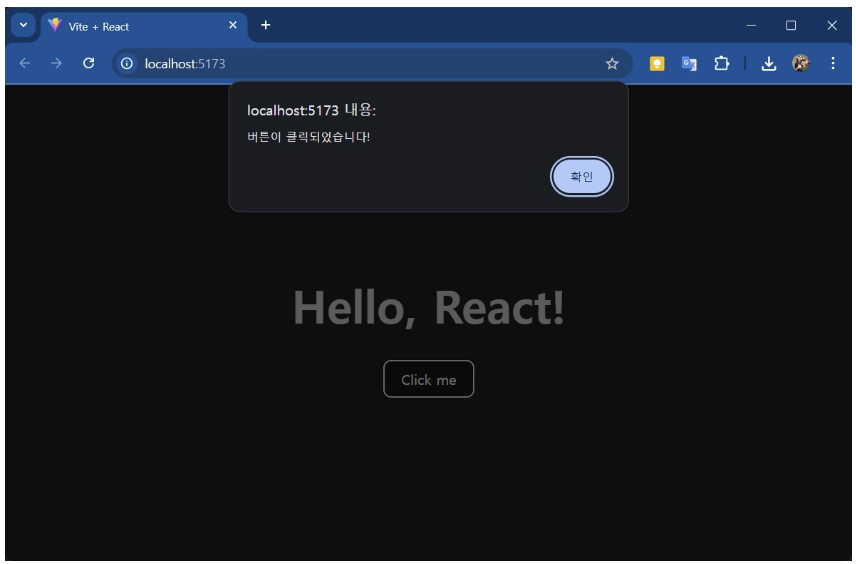
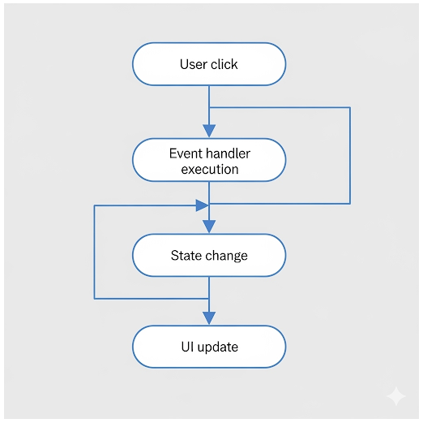


## 8. 컴포넌트 설계 원칙
- React 개발에서 중요한 것은 UI를 어떻게 쪼개고 재사용할지입니다. 
1. **단일 책임 원칙**: 하나의 컴포넌트는 하나의 기능만 담당합니다. 

2. **재사용성**: 여러 화면에서 쓰일 수 있도록 범용적으로 설계합니다. 

3. **계층적 구조**: 큰 화면을 작은 컴포넌트로 나누고, 이를 조립해 전체 UI를 완성합니다.

### 예시: 로그인 화면
- LoginPage
    - Header
    - LoginForm
        - InputEmail
        - InputPassword
        - SubmitButton

#### 👉 이렇게 나누면 유지보수와 재사용이 훨씬 쉬워집니다.
```
src/
 ┣ App.jsx
 ┣ pages/
 ┃ ┗ LoginPage.jsx
 ┣ components/
 ┃ ┣ Header.jsx
 ┃ ┗ login/
 ┃    ┣ LoginForm.jsx
 ┃    ┣ InputEmail.jsx
 ┃    ┣ InputPassword.jsx
 ┃    ┗ SubmitButton.jsx
 ┗ styles/
    ┗ auth.css
```
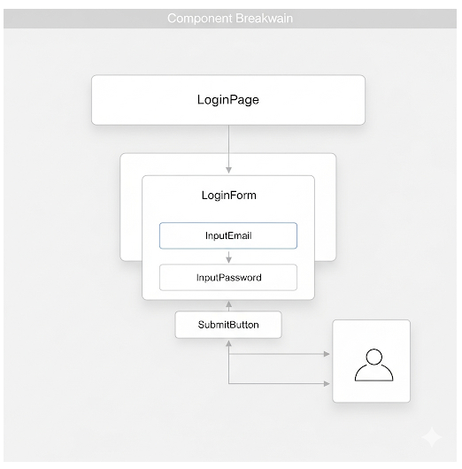


## 9. 실습: 간단한 사용자 카드 컴포넌트

### 목표
- Props로 이름과 나이를 전달받아 표시
- 버튼 클릭 시 나이가 1 증가

### 코드
```javascript
import { useState } from "react";

function UserCard(props) {
  const [age, setAge] = useState(props.age);

  return (
    <div style={{ border: "1px solid gray", padding: "10px", width: "200px" }}>
      <h3>{props.name}</h3>
      <p>나이: {age}</p>
      <button onClick={() => setAge(age + 1)}>한 살 더 먹기</button>
    </div>
  );
}

// 사용 예시
<UserCard name="홍길동" age={20} />
```
#### 👉 Props는 초기값으로만 사용하고, 변경되는 값은 state로 관리하는 좋은 예시입니다.

- App.jsx 에 작성하면 아래와 같습니다.
```javascript
import './App.css'

import { useState } from "react";

// UserCard 컴포넌트: props로 받은 초기 나이를 state로 관리
function UserCard(props) {
  const [age, setAge] = useState(props.age);

  return (
    <div
      style={{
        border: "1px solid gray",
        padding: "10px",
        width: "220px",
        borderRadius: "10px",
        margin: "8px",
      }}
    >
      <h3 style={{ margin: "0 0 8px" }}>{props.name}</h3>
      <p style={{ margin: "0 0 12px" }}>나이: {age}</p>
      <button onClick={() => setAge(age + 1)}>한 살 더 먹기</button>
    </div>
  );
}

// App 컴포넌트: UserCard 사용 예시
export default function App() {
  return (
    <main style={{ padding: 20, fontFamily: "system-ui, sans-serif" }}>
      <h1 style={{ marginTop: 0 }}>Hello, React!</h1>
      <p style={{ color: "#666" }}>아래 버튼을 눌러 나이를 증가시켜 보세요.</p>

      <section style={{ display: "flex", flexWrap: "wrap" }}>
        {/* 사용 예시 */}
        <UserCard name="홍길동" age={20} />
        {/* 필요하면 카드 더 추가 가능 */}
        {/* <UserCard name="김영희" age={32} /> */}
      </section>
    </main>
  );
}
```
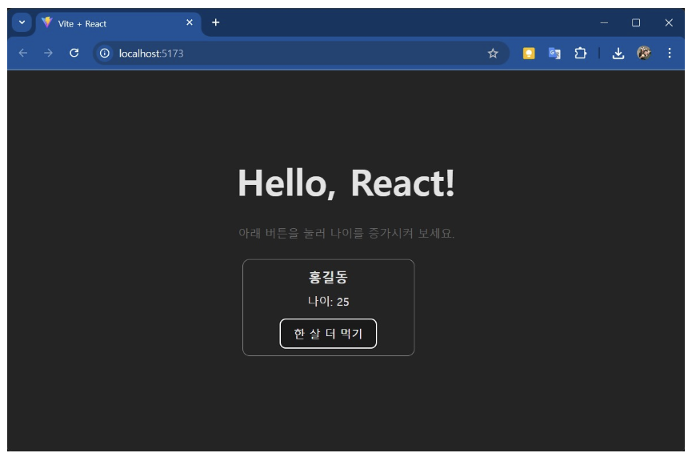