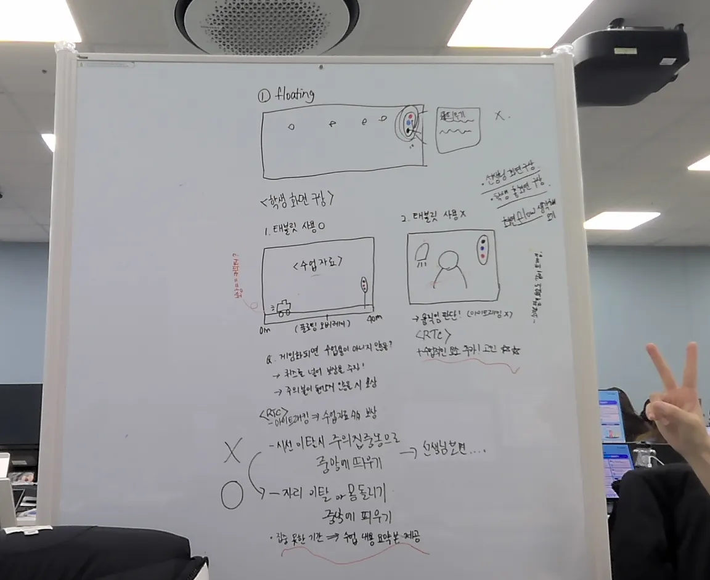

## 회의 안건
1. 프로젝트 주제 선정 및 구체화
2. 프로젝트 기획
3. 미팅

## 회의록

### 미팅 정리 (12시)
- 웹이든 앱이든 큰 차이는 없음
- 위젯 형태로 구현 가능하면 그 방향으로 진행
- 현직 교사 피드백이 중요함 → 현직자 인터뷰 넣는 건 매우 좋음
- 기대효과가 어느 정도 설득력 있는지가 중요
- 나중에 시연에서 무엇을 보여줄지 고민 필요
- 캐릭터를 넣으면 작업량이 많아짐 → 보상 요소(+a)로 고려
- 캐릭터는 생성형 AI 활용
- 전체적인 방향성 설정이 매우 중요함
- 효과가 있는지 없는지를 어떻게 보여줄지가 핵심 문제 ★★
    - 직접 테스트를 통한 검증이 중요
- 시연은 현장에서 직접 하는 것이 중요
- 얼굴은 모자이크 처리 후 직접 촬영하는 방식이 좋음
- 교사용 화면은 선생님 의견을 들어보고 결정하는 것이 좋음
- 현장에서는 학생들이 어디를 보는지 이미 확인 가능 → 굳이 필요한지 고민 필요
- 코랩 코기 모드는 괜찮은 선택
- GPU는 학습용으로 사용 ★★

### 주요기능 회의 및 깜짝 코치님들과의 대화(17시)
- **집중기능**
    - 신호등 이미지로 floating 시스템
    - 앱 밖으로 나와 화면 최상단에 그려지는것
        - [안드로이드 기능]안드로이드 플로팅 윈도우
        - [안드로이드 기능]시스템 오버레이
        
- **상황 구분**
    - 태블릿을 교육 자료로 수업할때
    - 태블릿을 교육 자료로 사용하지 않을때

- **코치님들 깜짝 피드백**
    1. 대기상태 위젯처럼 수업에 조금이라도 도움되는 요소 있으면 좋다
        
        (시간표 수업 요소, 알림장, 체크리스트) 
        
    2. 보상을 주는 기준 생각해보아야함 
    3. 아동 관리 가이드 찾아보기(ui, ux) 
    4. adhd 심리적으로 건드리지 않는 색감, 디자인 등등 찾아보기 
    5. 일어나려고 할때 5, 4, 3, 2, 1 

- **화이트보드 최종 정리**
