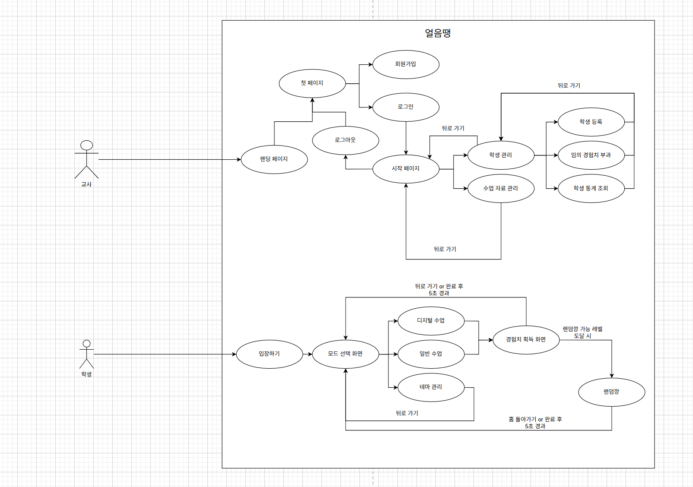
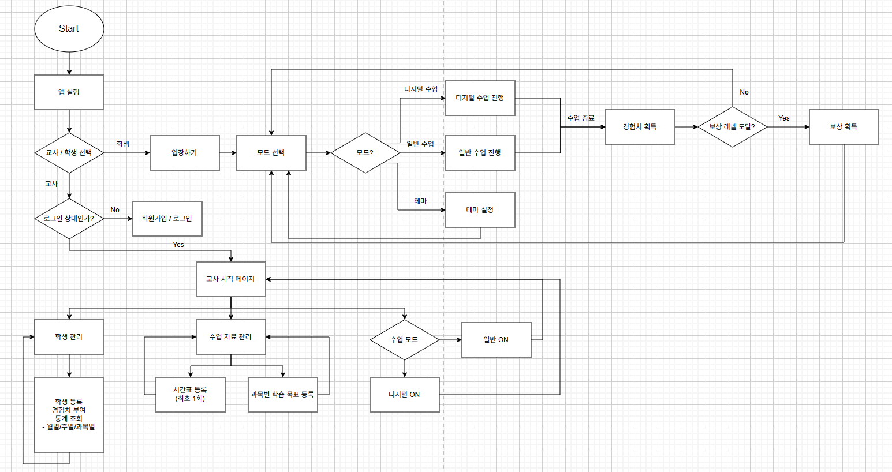
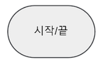
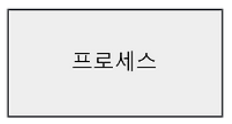
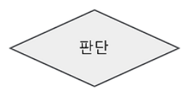
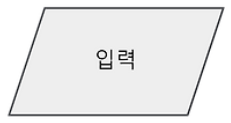
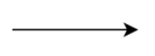
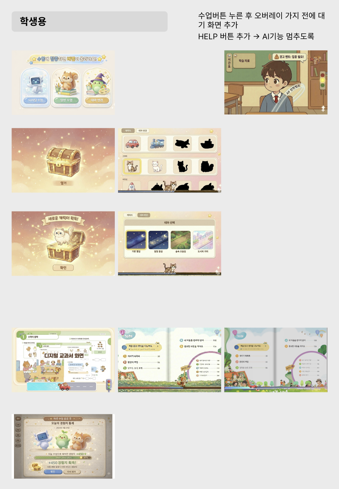
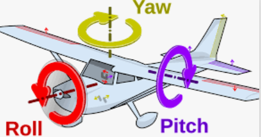
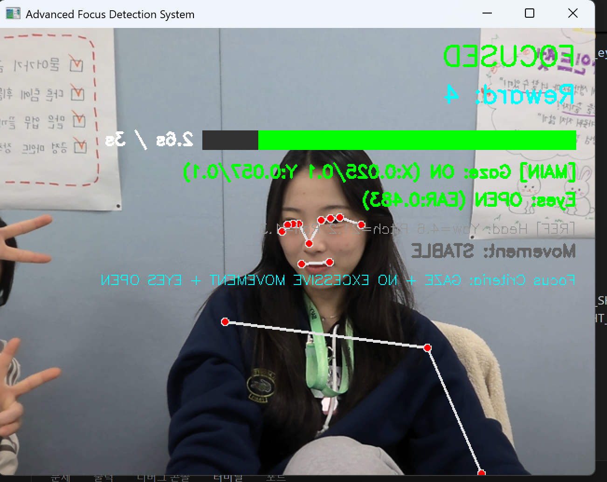

## 유스케이스 다이어그램

### usecase diagram 개념
: 시스템과 사용자의 상호작용을 다이어그램으로 표현한 것으로 사용자의 관점에서 시스템의 서비스 혹은 기능 및 그와 관련한 외부 요소를 보여주는 것

-> 즉, 사용자와 시스템 사이의 관계를 나타냄

**구성요소**
- 시스템(System)

    : 만들고자 하는 프로그램

    : 유스케이스들을 둘러싼 사각형 틀로 시스템 명칭을 안쪽 상단에 작성함

- 액터(Actor)

    : 시스템의 외부에 있고 시스템과 상호작용을 하는 사람(시스템의 기능을 사용하는 사람), 시스템(시스템에 정보를 제공하는 도다른 시스템)
    
    : 원과 선을 조합하여 만든 사람 모양으로 표현

    : 액터명은 위나 아래에 표시하며 액터의 역할을 작성함

- 유스케이스(Usecase)

    : 사용자의 입장에서 바라본 시스템의 기능
    
    : 시스템이 액터에게 제공해야 하는 기능으로 시스템의 요구사항을 나타냄

    : 타원으로 표시하고 안쪽에 유스케이스명을 작성함

- 관계(Relation)

    - 연관관계

        : 유스케이스와 액터 간의 상호작용이 있음을 표현

        : 유스케이스와 액터를 실선으로 연결함

    - 포함관계

        : 하나의 유스케이스가 다른 유스케이스의 실행을 전제로 할 때 형성

        : 포함되는 유스케이스는 포함하는 유스케이스를 실행하기 위해 반드시 실행되어야 하는 경우에 적용

        : 포함하는 유스케이스에서 포함되는 유스케이스 방향으로 화살표를 점선으로 연결하고 <<include>>라고 표기

    - 확장관계

        : 확장 기능 유스케이스와 확장 대상 유스케이스 사이에 형성되는 관계

        : 확장 대상 유스케이스를 수행할 때 특정 조건에 따라 확장 기능 유스케이스를 수행하는 경우에 적용

        : 확장 기능 유스케이스에서 확장 대상 유스케이스 방향으로 화살표를 점선으로 연결하고 <<extend>>라고 표기

    - 일반화 관계

        : 유사한 유스케이스 또는 액터를 모아 추상화한 유스케이스 또는 액터와 연결시켜 그룹을 만들어 이해도를 높이기 위한 관계

        : 구체적인 유스케이스에서 추상적인 유스케이스 방향으로 끝부분이 삼각형으로 표현된 화살표를 실선으로 연결하여 표현

## Flow Chart

### flow chart 개념
: 순서도 또는 흐름도라고도 함

: 어떤 일을 처리하는 과정을 순서대로 간단한 기호와 도형으로 도식화한 것

: 문제나 작업의 범위를 결정하고 분석하며, 그 해석 방법을 명확히 하기 위해 필요한 작업과 처리의 순서를 통일된 기호와 도형을 사용하여 도식적으로 표시한 것

**표준 기호**
- 시작 / 끝(Strat / End)

    

    : Flow Chart의 시작과 끝을 표시

- 처리 프로세스(Process)

    

    : 모든 처리 과정을 표시

    : 기호 내에 처리 내용을 기입함

    : 화면(페이지)을 구분하는 용도로도 사용함

- 판단 / 결정(Decision)

    

    : 조건에 따라 분기되는 Case를 표시

- 입.출력 / 데이터(Input / Data)

    

    : 모든 종류의 입력과 출력을 표시

- 출력 / 문서(Document)

    

    : 액션 이후 표시되는 문구를 나타낼 때 주로 사용

- 화살표(Flow Arrow)

    

    : 각 기호 간의 연결 관계를 나타냄

### 느낀점 및 회고_ 유스케이스 및 플로우 차트
처음 유스케이스 다이어그램을 그렸던 1학기 때는 무엇이 중요한지 몰라 많은 것을 놓쳤습니다. 그 대가로 코드를 짜는 중간중간 계속해서 화면을 추가하고 설계를 뜯어고쳐야만 했습니다. 그래서 이번만큼은 '돌아가더라도 정확하게 가자'는 마음으로 설계에 임했습니다.

제가 가장 잘 이해할 수 있는 방식으로 유스케이스를 먼저 그려보고, 그 밑그림을 바탕으로 플로우차트를 한 단계씩 완성해 나갔습니다. 비록 지금 만든 설계도 완벽하지 않을 수 있고 훗날 보면 빈틈이 보일지 모릅니다. 하지만 모호했던 머릿속의 아이디어를 눈에 보이는 '흐름'으로 명확히 시각화했다는 것, 그리고 이전보다 서비스를 훨씬 깊이 있게 이해하고 프로젝트를 시작한다는 점에서 이번 설계 과정은 저에게 큰 자산이 되었습니다.

## Figma 작업

: 학생이 애플리케이션을 사용하면서 보이는 화면(수업 모드 선택, 보상 화면, 테마 및 캐릭터 변경, 수업 화면) 목업 만들기 및 수정

### 느낀점 및 회고_ Figma 작업
Figma를 활용해 목업을 제작하면서 초기 기획 단계에서 미처 고려하지 못했던 화면 구성이나 사용자 흐름상의 누락된 부분이 생각보다 많다는 것을 느꼈습니다. 이로 인해 수정과 보완을 반복하는 과정이 필요했으며, 특히 디자인 요소와 화면 구성의 통일성을 맞추기 위해 팀원들과 지속적으로 소통하는 데 예상보다 많은 시간이 소요되었습니다. 다만 이 과정을 통해 기획의 중요성과 디자인 협업에서 명확한 기준을 사전에 정하는 것이 얼마나 중요한지 다시 한 번 느낄 수 있었습니다.

## AI 모델 탐색
- MediaPipe 사용할 계획
- MediaPipe Pose로 행동 처리
- MediaPipe Face Landmarker(구 Face Mesh)로 시선 처리 + 행동 처리

**MediaPipe Pose + MediaPipe Face Landmarker(구 Face Mesh)**

- 한 번의 추론으로 얼굴 전체 윤곽(Face Mesh), 눈동자(Iris), 머리 자세(Head Pose) 정보 동시 제공
- 시선 탐지(Gaze Tracking)
    - 눈의 안쪽/바깥쪽 코너 좌표와 눈동자 중심 좌표의 비율을 계산하여 사용자가 화면의 왼쪽/오른쪽/위/아래 중 어디를 보고 있는지 추정 가능
    - 태블릿 화면을 4-9개 구역으로 나누어 어느 구역을 보는지 파악하는 용도로 충분히 사용 가능할 것
- 행동 탐지(집중도 및 움직임)
    - 산만함(움직임) 탐지
    - 집중 실패 탐지

<집중 안 함을 어떤 기준으로 판단할 것인가?>
(경우의 수)
1. 시선 화면 + 고개 yaw 0 -> 집중O
2. 시선 화면 + 고개 yaw +- 30도 -> 집중O
3. 시선 바깥 + 고개 yaw +- 30도 -> 집중X
4. 시선 바깥 + 고개 yaw 0 -> 집중X
5. 눈 깜빡임 -> 집중O(영향 X)
6. 눈 감음(20초 이상) -> 집중X
7. 시선 화면 + 고개 pitch 0 -> 집중O
8. 시선 화면 + 고개 pitch +- n -> 집중O
9. 시선 바깥 + 고개 pitch 0 -> 집중X
10. 시선 바깥 + 고개 pitch +- n -> 집중X
11. 시선 화면 + 고개 roll 0 -> 집중O
12. 시선 화면 + 고개 roll +- n -> 집중O
13. 시선 바깥 + 고개 roll +- n -> 집중X
14. 시선 바깥 + 고개 roll 0 -> 집중X
15. 지속적인 신체 움직임(앞뒤, 좌우 등 모두/연속5회 이상) -> 집중X
16. 지속적인 고개 움직임(상하좌우 모두/연속5회 이상) -> 집중X

**프로토타입**
